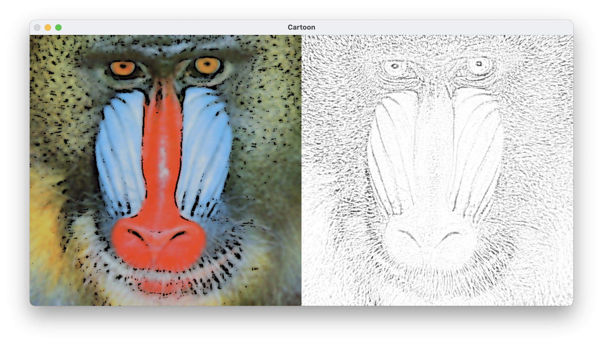

# Sketch rendering using python-opencv
- image rendering into cartoon or sketch style

chatgpt recommended a code that produces the result on the left.  
and I used it to create the result on the right.
## screenshot

